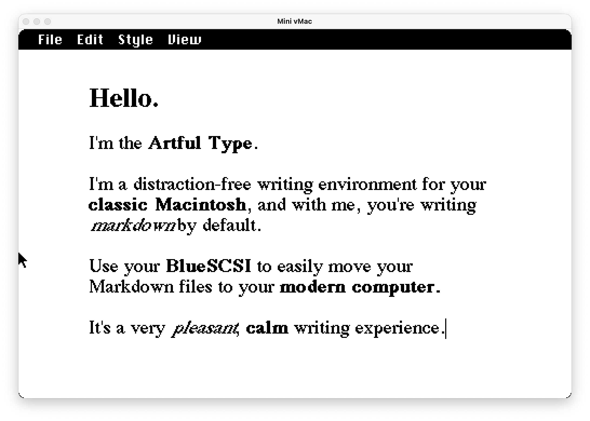

# ArtfulType

A distraction-free Markdown writing app for classic 68k Macintosh computers (System 6/7), built to run from a [BlueSCSI](https://bluescsi.com) device on a Mac Plus or similar compact Mac.

## Features

- **Writer mode** — live Markdown-to-rich-text formatting as you type (bold, italic, code, headings, links)
- **Markdown mode** — plain raw-syntax editing
- Links: type `[text](url)` inline, or select text and use Style → Link
- Cut/Copy/Paste and multi-level Undo/Redo, with standard keyboard shortcuts
- Adjustable zoom, remembered between launches
- Save/Open plain Markdown files via the classic File Manager
- A well-behaved classic app: About and desk accessories in the Apple menu, MultiFinder-friendly (dims quietly in the background), zoom preference stored in the system Preferences folder

Video overview: [Artful Type demo](https://youtu.be/HEheu_r9UGw)

## Getting Started

If your Mac can use [BlueSCSI](https://bluescsi.com), use the BlueSCSI image. If it can't (or you just want a physical floppy), use the 800K floppy image instead.

### Real hardware with BlueSCSI

1. Copy `HD1_ArtfulType.hda` onto your BlueSCSI SD card — the `HD1_` prefix is BlueSCSI's naming convention for assigning an image to SCSI ID 1, so no renaming is needed. (See [BlueSCSI](https://bluescsi.com) for how to set up and image an SD card for your specific BlueSCSI hardware.)
2. Boot the Mac. The Finder will appear as usual — double-click ArtfulType to launch it.
3. To also write a physical 800K floppy: open `Utilities/Disk Copy 4.2` (already on the disk image), and use it to write `ArtfulType 800K` (also already on the disk image, in proper DiskCopy 4.2 format) to a blank floppy in your Mac's floppy drive.

### Real hardware without BlueSCSI

Write `ArtfulType-800K.dsk` to a real 800K floppy disk and boot from it directly — no BlueSCSI required.

### In an emulator (Mini vMac)

For trying ArtfulType without real hardware, use [Mini vMac](https://www.gryphel.com/c/minivmac/) configured for a Mac Plus, with either:
- `ArtfulType-20MB.dsk` — the full HD setup (System 7.1, stripped down, with the app, Disk Copy, and the embedded floppy image)
- `ArtfulType-800K.dsk` — a bootable 800K floppy (System 6.0.8) with just the app

## Usage

ArtfulType has two views, toggled from the View menu:

- **Writer** (default) — markdown syntax is hidden; text is shown styled (bold, italic, headings, etc.)
- **Markdown** — the raw markdown source, unstyled

Saved files are plain `.md` text, editable in any text editor.

### Keyboard shortcuts

| Action | Shortcut |
|---|---|
| New / Open / Save | ⌘N / ⌘O / ⌘S |
| Quit | ⌘Q |
| Undo / Redo | ⌘Z / ⇧⌘Z |
| Cut / Copy / Paste | ⌘X / ⌘C / ⌘V |
| Select All | ⌘A |
| Bold / Italic / Code | ⌘B / ⌘I / ⌘K |
| Heading 1 / 2 / 3 | ⌘1 / ⌘2 / ⌘3 |
| Link | ⌘L |
| Zoom In / Out / Default | ⌘= / ⌘- / ⌘0 |

## Building

Built with [Retro68](https://github.com/autc04/Retro68), a GCC-based cross-compiler for classic Mac OS. See `app/CMakeLists.txt` for the build configuration, and `deploy.sh` / `build-bluescsi-image.sh` / `package-release.sh` for the build-to-disk-image pipeline.

## License

Code: GPLv3 — see [LICENSE](LICENSE).

Creative assets (the ArtfulType name/branding, icon, and artwork): all rights reserved — see [ASSETS_LICENSE](ASSETS_LICENSE).

## AI Disclaimer

Claude Code was used in the creation of this software.
